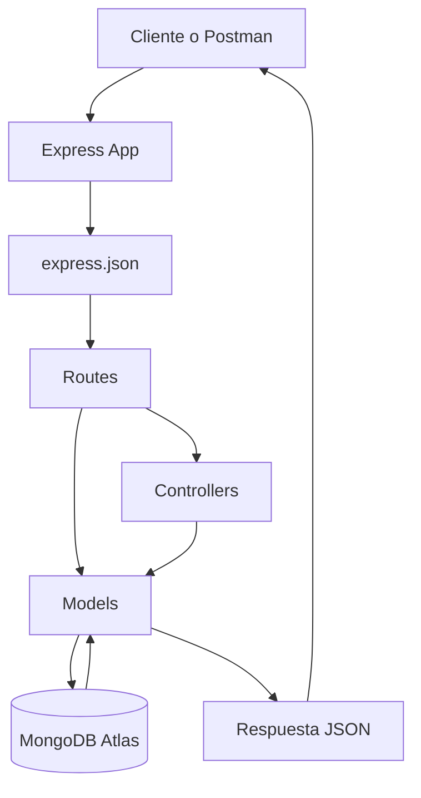
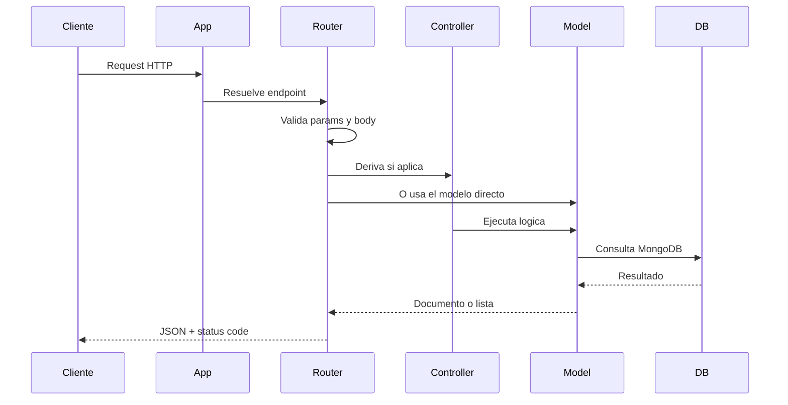
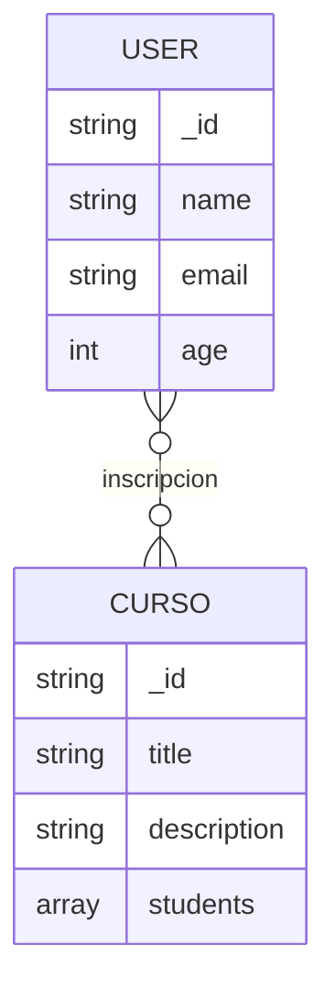
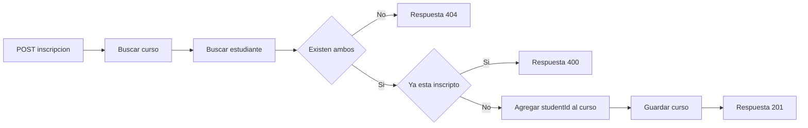
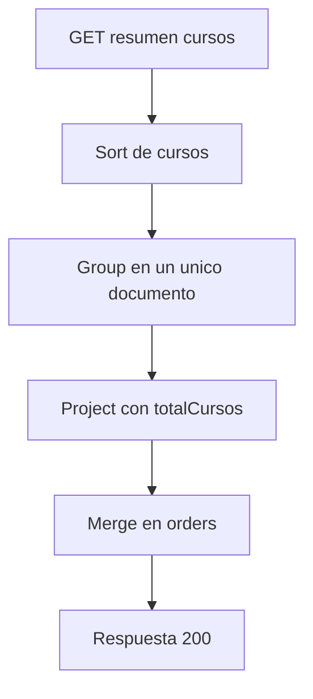

# Proyecto Backend

API REST desarrollada con Node.js, Express y MongoDB Atlas para la gestion de estudiantes, cursos, consultas con `populate` y operaciones de agregacion.

## Descripcion

El proyecto expone una API organizada por recursos y preparada para trabajar con:

- estudiantes
- cursos
- inscripciones entre estudiantes y cursos
- consultas con `populate`
- agregaciones sobre la coleccion de cursos

La aplicacion usa Express para el enrutamiento, Mongoose para modelar datos y MongoDB Atlas como base de datos.

## Tecnologias

- Node.js
- Express
- Mongoose
- MongoDB Atlas
- ES Modules
- Nodemon
- Postman

## Arquitectura

La estructura actual sigue una separacion simple entre arranque de aplicacion, rutas, controladores y modelos:

- `app.js`: inicializa Express, monta rutas y arranca el servidor
- `routes/`: define endpoints HTTP por modulo
- `controllers/`: contiene logica especializada, hoy usada para agregaciones
- `config/models/`: define los esquemas y modelos de Mongoose
- `config/db/`: encapsula la conexion a MongoDB
- `postman/`: guarda colecciones para pruebas manuales

## Diagrama de Arquitectura



## Flujo Completo de una Request



## Estructura Actual del Proyecto

```mermaid
flowchart TD
    root[proyectoBackend]
    root --> appjs[app.js]
    root --> readme[README.md]
    root --> packagejson[package.json]
    root --> packagelock[package-lock.json]
    root --> atlas[atlas.txt]
    root --> productos[productos.json]
    root --> controllers[controllers]
    root --> config[config]
    root --> routes[routes]
    root --> postman[postman]

    controllers --> aggregationsController[aggregations.controller.js]

    config --> dbFolder[db]
    config --> modelsFolder[models]
    dbFolder --> connectConfig[connect.config.js]
    modelsFolder --> cursoModel[curso.model.js]
    modelsFolder --> userModel[user.model.js]

    routes --> homeRouter[home.router.js]
    routes --> userRouter[user.router.js]
    routes --> courseRouter[courses.router.js]
    routes --> populateRouter[populate.router.js]
    routes --> aggregationsRouter[aggregations.router.js]

    postman --> cursoCollection[Curso.postman_collection.json]
    postman --> usersCollection[Users.postman_collection.json]
    postman --> productosCollection[Productos.postman_collection.json]
```



## Arranque de la Aplicacion

Archivo principal: `app.js`

Responsabilidades:

- crear la aplicacion Express
- habilitar el middleware `express.json()`
- montar routers de home y API
- manejar errores `404`
- conectar MongoDB
- iniciar el servidor en el puerto `3000`

Rutas montadas actualmente:

- `/`
- `/api/students`
- `/api/curso`
- `/api/popular`
- `/api/aggregations`

## Modelos de Datos

### `User`

Definido en `config/models/user.model.js`

Campos:

- `name`: `String`, obligatorio
- `email`: `String`, obligatorio, unico
- `age`: `Number`, obligatorio

### `Curso`

Definido en `config/models/curso.model.js`

Campos:

- `title`: `String`, obligatorio, indexado
- `description`: `String`, opcional
- `students`: arreglo de `ObjectId` con referencia a `User`

## Relacion de Datos



## Conexion a Base de Datos

La conexion se resuelve desde `config/db/connect.config.js`.

Modos contemplados:

- `local`
- `atlas`

Actualmente el servidor arranca con:

```js
await connectMongoDB("atlas");
```

## Endpoints y Metodos

### Home

#### `GET /`

Respuesta simple de bienvenida:

```json
{
  "title": "Bienvenidos"
}
```

### Students

Base path: `/api/students`

#### `GET /api/students`

Obtiene todos los estudiantes.

#### `POST /api/students`

Crea un estudiante nuevo.

Body de ejemplo:

```json
{
  "name": "Sofia Arano",
  "email": "sofia.arano@example.com",
  "age": 32
}
```

#### `GET /api/students/:id`

Busca un estudiante por `ObjectId`.

Comportamiento:

- `400` si el id tiene formato invalido
- `404` si el estudiante no existe

#### `PUT /api/students/:id`

Actualiza un estudiante existente.

#### `DELETE /api/students/:id`

Elimina un estudiante por id.

### Cursos

Base path: `/api/curso`

#### `GET /api/curso`

Obtiene todos los cursos.

#### `POST /api/curso`

Crea un nuevo curso.

Body de ejemplo:

```json
{
  "title": "Backend Avanzado",
  "description": "Curso de Node.js con MongoDB",
  "students": []
}
```

#### `POST /api/curso/:courseId/inscription/:studentId`

Inscribe un estudiante en un curso.

Proceso:

- busca el curso por `courseId`
- busca el estudiante por `studentId`
- valida que ambos existan
- valida que no haya duplicados
- agrega el `ObjectId` del alumno al array `students`

#### `DELETE /api/curso/:courseId/desinscription/:studentId`

Desinscribe un estudiante de un curso.

#### `DELETE /api/curso/:courseId`

Elimina un curso.

### Populate

Base path: `/api/popular`

#### `GET /api/popular/demo`

Ejecuta una consulta con `populate` sobre `students` para traer datos completos de los estudiantes asociados a cada curso.

Campos poblados:

- `name`
- `email`
- `age`
- `_id`

### Aggregations

Base path: `/api/aggregations`

#### `GET /api/aggregations/cursos/resumen`

Ejecuta una agregacion sobre la coleccion de cursos.

El flujo actual:

- ordena cursos
- agrupa todos los cursos en un unico array
- proyecta un resumen con total de cursos
- guarda el resultado en la coleccion `orders` mediante `$merge`

Respuesta actual:

```json
{
  "message": "Resumen generado y guardado en 'orders'"
}
```

## Flujo de Inscripcion



## Flujo de Aggregation



## Estados HTTP Utilizados

- `200 OK`
- `201 Created`
- `204 No Content`
- `400 Bad Request`
- `404 Not Found`
- `500 Internal Server Error`

## Manejo de Errores

El proyecto incluye:

- `try/catch` en varios endpoints
- validacion de `ObjectId` en rutas de estudiantes
- middleware global para rutas no encontradas

Respuesta global `404`:

```json
{
  "title": "404 - Pagina no encontrada"
}
```

## Ejemplos Rapidos para Postman

### Crear estudiante

```http
POST http://localhost:3000/api/students
Content-Type: application/json
```

```json
{
  "name": "Natalia Perez",
  "email": "natalia.perez@example.com",
  "age": 24
}
```

### Buscar estudiante por ID

```http
GET http://localhost:3000/api/students/69bf8c134bd56c8093bb724e
```

### Crear curso

```http
POST http://localhost:3000/api/curso
Content-Type: application/json
```

```json
{
  "title": "Backend Avanzado",
  "description": "Curso de Node.js con MongoDB",
  "students": []
}
```

### Inscribir estudiante

```http
POST http://localhost:3000/api/curso/ID_CURSO/inscription/ID_ESTUDIANTE
```

### Probar populate

```http
GET http://localhost:3000/api/popular/demo
```

### Ejecutar aggregation

```http
GET http://localhost:3000/api/aggregations/cursos/resumen
```

## Como Ejecutar el Proyecto

### 1. Instalar dependencias

```bash
npm install
```

### 2. Iniciar el servidor

Modo desarrollo:

```bash
npm run dev
```

Modo normal:

```bash
npm start
```

### 3. Probar en local

```text
http://localhost:3000
```

## Colecciones Postman

Archivos disponibles:

- `postman/Users.postman_collection.json`
- `postman/Curso.postman_collection.json`
- `postman/Productos.postman_collection.json`

## Observaciones Tecnicas

- las rutas API ahora usan prefijo `/api`
- estudiantes y cursos siguen una relacion por referencias
- `populate` permite resolver esas referencias al consultar cursos
- la agregacion actual guarda el resumen en la coleccion `orders`
- el proyecto usa ES Modules con `import` y `export`

## Mejoras Posibles

- mover mas logica desde `routes/` a `controllers/`
- agregar validaciones de `ObjectId` en cursos y aggregations
- usar variables de entorno para credenciales y configuracion
- incorporar servicios para separar reglas de negocio
- agregar tests automatizados
- documentar la API con Swagger

## Autor

Proyecto desarrollado por Sofia Arano Ibarra.
