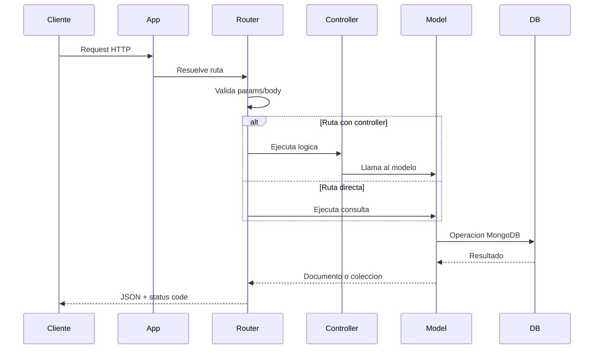
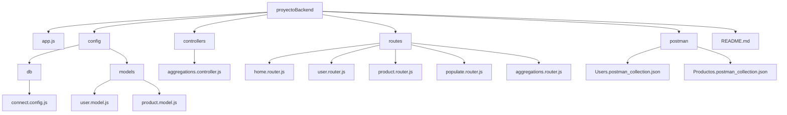
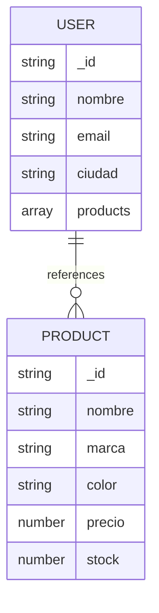
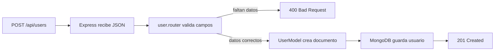
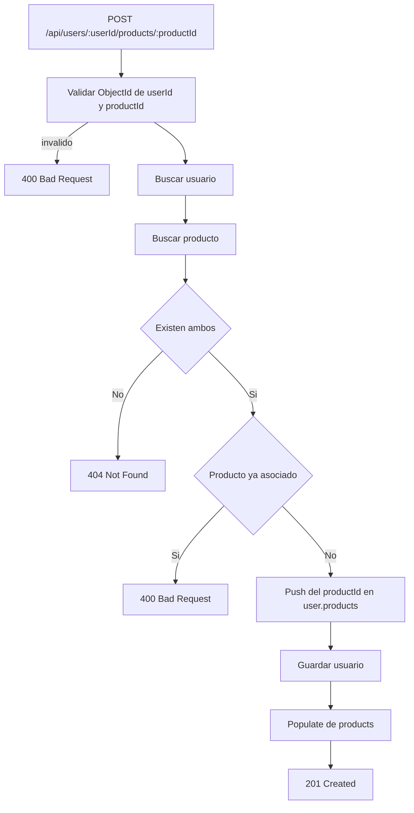
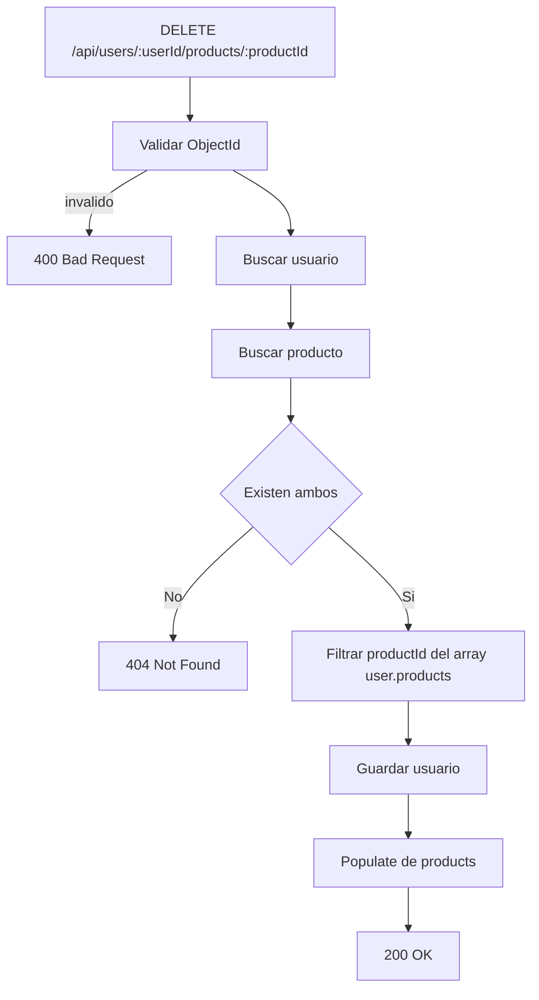
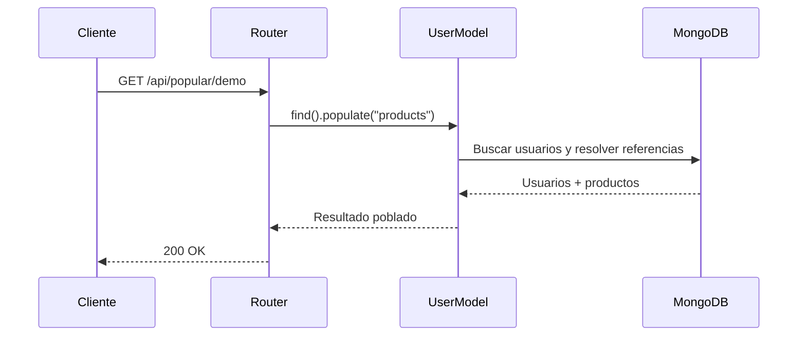
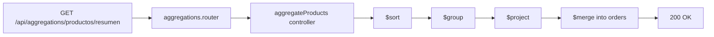

# Proyecto Backend

API REST construida con Node.js, Express y MongoDB/Mongoose para administrar usuarios, productos, relaciones entre ambos, consultas con `populate` y una agregacion sobre la coleccion de productos.

## Objetivo

El proyecto expone endpoints HTTP para:

- crear, listar, buscar, actualizar y eliminar usuarios
- crear, listar, buscar, actualizar y eliminar productos
- asociar productos a usuarios
- quitar productos de usuarios
- consultar usuarios con sus productos relacionados usando `populate`
- ejecutar una agregacion y guardar el resultado en otra coleccion

## Stack Tecnologico

- Node.js
- Express
- Mongoose
- MongoDB Atlas o MongoDB local
- ES Modules
- Nodemon
- Postman

## Arquitectura General

La aplicacion esta organizada en capas simples:

- `app.js`: punto de entrada, middlewares, montaje de routers y arranque del servidor
- `routes/`: define los endpoints HTTP y resuelve la mayor parte de la logica de request/response
- `controllers/`: encapsula logica especializada, hoy usada en agregaciones
- `config/models/`: define esquemas y modelos de Mongoose
- `config/db/`: centraliza la conexion a MongoDB
- `postman/`: colecciones para pruebas manuales

## Diagrama de Arquitectura

```mermaid
flowchart TD
    cliente[Cliente o Postman] --> app[app.js]
    app --> middleware[express.json()]
    middleware --> routers[Routers]
    routers --> userRouter[user.router.js]
    routers --> productRouter[product.router.js]
    routers --> populateRouter[populate.router.js]
    routers --> aggregationRouter[aggregations.router.js]
    aggregationRouter --> controller[aggregations.controller.js]
    userRouter --> userModel[UserModel]
    userRouter --> productModel[Product]
    productRouter --> productModel
    populateRouter --> userModel
    controller --> productModel
    userModel --> mongo[(MongoDB)]
    productModel --> mongo
```

## Flujo General de una Request



## Estructura del Proyecto

```text
proyectoBackend/
├── app.js
├── README.md
├── package.json
├── package-lock.json
├── atlas.txt
├── productos.json
├── config/
│   ├── db/
│   │   └── connect.config.js
│   └── models/
│       ├── product.model.js
│       └── user.model.js
├── controllers/
│   └── aggregations.controller.js
├── postman/
│   ├── Productos.postman_collection.json
│   └── Users.postman_collection.json
└── routes/
    ├── aggregations.router.js
    ├── home.router.js
    ├── populate.router.js
    ├── product.router.js
    └── user.router.js
```

## Diagrama de Estructura



## Punto de Entrada

El archivo principal es `app.js`.

Responsabilidades:

- crea la aplicacion Express
- habilita `express.json()`
- monta routers
- maneja rutas inexistentes con respuesta `404`
- conecta a MongoDB
- levanta el servidor en el puerto `3000`

Routers montados:

- `/`
- `/api/users`
- `/api/product`
- `/api/popular`
- `/api/aggregations`

## Conexion a Base de Datos

La conexion vive en `config/db/connect.config.js`.

Soporta dos modos:

- `local`
- `atlas`

Actualmente el proyecto arranca con:

```js
await connectMongoDB("atlas");
```

La funcion selecciona la URL segun el modo recibido y luego ejecuta `mongoose.connect(URL)`.

## Modelos de Datos

### User

Definido en `config/models/user.model.js`.

Campos:

- `nombre`: `String`, obligatorio
- `email`: `String`, obligatorio, unico e indexado
- `ciudad`: `String`, opcional
- `products`: `ObjectId[]`, referencia a `Product`

Hooks:

- `pre('save')`: imprime en consola el nombre del usuario guardado
- `post('find')`: imprime cuántos usuarios fueron consultados

### Product

Definido en `config/models/product.model.js`.

Campos:

- `nombre`: `String`, obligatorio e indexado
- `marca`: `String`, opcional
- `color`: `String`, opcional
- `precio`: `Number`, obligatorio
- `stock`: `Number`, obligatorio

## Relacion entre Entidades

La relacion actual se modela desde el usuario:

- un usuario puede tener muchos productos
- el usuario guarda un arreglo `products` con referencias a documentos `Product`



## Routers y Responsabilidades

### Home Router

Archivo: `routes/home.router.js`

Endpoints:

- `GET /`

Devuelve una respuesta simple de bienvenida.

### User Router

Archivo: `routes/user.router.js`

Responsabilidades:

- CRUD de usuarios
- asignacion de productos a usuarios
- eliminacion de productos de usuarios
- consultas con `populate("products")`

### Product Router

Archivo: `routes/product.router.js`

Responsabilidades:

- CRUD de productos
- validacion de `ObjectId` en lecturas y actualizaciones por ID

### Populate Router

Archivo: `routes/populate.router.js`

Responsabilidad:

- consultar usuarios junto con sus productos referenciados usando `populate`

### Aggregations Router

Archivo: `routes/aggregations.router.js`

Responsabilidad:

- delegar al controller de agregaciones la construccion de un resumen de productos

## Endpoints Disponibles

### Home

#### `GET /`

Respuesta:

```json
{
  "title": "Bienvenidos"
}
```

### Usuarios

Base path: `/api/users`

#### `GET /api/users`

Obtiene todos los usuarios.

Respuesta:

```json
{
  "users": []
}
```

#### `POST /api/users`

Crea un usuario.

Body de ejemplo:

```json
{
  "nombre": "Sofia",
  "email": "sofia@example.com",
  "ciudad": "Buenos Aires"
}
```

Respuestas esperadas:

- `201` si el usuario fue creado
- `400` si faltan campos obligatorios
- `500` si ocurre un error del servidor

#### `GET /api/users/:id`

Busca un usuario por `ObjectId` y ademas hace `populate("products")`.

Respuestas esperadas:

- `200` si existe
- `400` si el formato del ID es invalido
- `404` si el usuario no existe

#### `PUT /api/users/:id`

Actualiza un usuario por ID con `findByIdAndUpdate`.

Opciones usadas:

- `returnDocument: "after"`
- `runValidators: true`

#### `DELETE /api/users/:id`

Elimina un usuario por ID.

Respuesta:

- `204` si se elimina correctamente

#### `POST /api/users/:userId/products/:productId`

Agrega un producto a un usuario.

Validaciones aplicadas:

- formato valido de ambos IDs
- existencia del usuario
- existencia del producto
- control de duplicados

#### `DELETE /api/users/:userId/products/:productId`

Quita un producto del arreglo `products` de un usuario.

Validaciones aplicadas:

- formato valido de ambos IDs
- existencia del usuario
- existencia del producto

### Productos

Base path: `/api/product`

#### `GET /api/product`

Obtiene todos los productos.

#### `POST /api/product`

Crea un producto.

Body de ejemplo:

```json
{
  "nombre": "Monitor",
  "marca": "Samsung",
  "color": "Negro",
  "precio": 350000,
  "stock": 8
}
```

#### `GET /api/product/:id`

Busca un producto por `ObjectId`.

Respuestas esperadas:

- `200` si existe
- `400` si el ID es invalido
- `404` si no existe

#### `PUT /api/product/:id`

Actualiza un producto por ID.

Opciones usadas:

- `returnDocument: "after"`
- `runValidators: true`

#### `DELETE /api/product/:productId`

Elimina un producto por ID.

Respuesta:

- `204` si se elimina correctamente

### Populate

Base path: `/api/popular`

#### `GET /api/popular/demo`

Devuelve la lista de usuarios con sus productos poblados.

Consulta ejecutada:

```js
UserModel.find().populate("products");
```

### Aggregations

Base path: `/api/aggregations`

#### `GET /api/aggregations/productos/resumen`

Ejecuta una agregacion sobre `Product` y guarda el resultado en la coleccion `orders`.

La pipeline actual:

- ordena los documentos
- agrupa todos los productos en un solo arreglo
- proyecta un documento resumen
- hace `$merge` hacia `orders`

Respuesta:

```json
{
  "message": "Resumen de productos generado y guardado en 'orders'"
}
```

## Flujo: Crear un Usuario



## Flujo: Agregar un Producto a un Usuario



## Flujo: Quitar un Producto de un Usuario



## Flujo: Consulta con Populate



## Flujo: Aggregation de Productos



## Codigos HTTP Utilizados

- `200 OK`
- `201 Created`
- `204 No Content`
- `400 Bad Request`
- `404 Not Found`
- `500 Internal Server Error`

## Manejo de Errores

El proyecto maneja errores principalmente con:

- bloques `try/catch`
- validacion de `ObjectId` en varios endpoints
- respuestas `404` para documentos inexistentes
- middleware final para rutas no encontradas

Respuesta del middleware `404`:

```json
{
  "title": "404 - Pagina no encontrada"
}
```

## Scripts Disponibles

### Instalar dependencias

```bash
npm install
```

### Modo desarrollo

```bash
npm run dev
```

### Modo normal

```bash
npm start
```

## Colecciones de Postman

Archivos incluidos:

- `postman/Users.postman_collection.json`
- `postman/Productos.postman_collection.json`

Casos cubiertos:

- CRUD de usuarios
- CRUD de productos
- agregar producto a usuario
- quitar producto de usuario

## Ejemplos Rapidos

### Crear usuario

```http
POST http://localhost:3000/api/users
Content-Type: application/json
```

```json
{
  "nombre": "Lucia",
  "email": "lucia@example.com",
  "ciudad": "Cordoba"
}
```

### Crear producto

```http
POST http://localhost:3000/api/product
Content-Type: application/json
```

```json
{
  "nombre": "Teclado",
  "marca": "Logitech",
  "color": "Negro",
  "precio": 48000,
  "stock": 14
}
```

### Agregar producto a usuario

```http
POST http://localhost:3000/api/users/ID_USUARIO/products/ID_PRODUCTO
```

### Quitar producto de usuario

```http
DELETE http://localhost:3000/api/users/ID_USUARIO/products/ID_PRODUCTO
```

### Obtener usuarios con populate

```http
GET http://localhost:3000/api/popular/demo
```

### Ejecutar agregacion

```http
GET http://localhost:3000/api/aggregations/productos/resumen
```

## Observaciones Tecnicas

- el proyecto usa `type: "module"` y por eso trabaja con `import` y `export`
- la mayor parte de la logica esta actualmente en los routers
- las agregaciones estan separadas en un controller dedicado
- `populate` resuelve la referencia desde `User.products` hacia `Product`
- el servidor arranca configurado para conectar a MongoDB Atlas

## Mejoras Recomendadas

- mover credenciales de MongoDB a variables de entorno
- unificar nombres de campos y mensajes de respuesta
- separar logica de negocio en servicios
- agregar validaciones de body mas estrictas
- incorporar tests automatizados
- documentar la API con Swagger/OpenAPI
- agregar paginacion y filtros en listados

## Autor

Proyecto desarrollado por Sofia Arano Ibarra.
