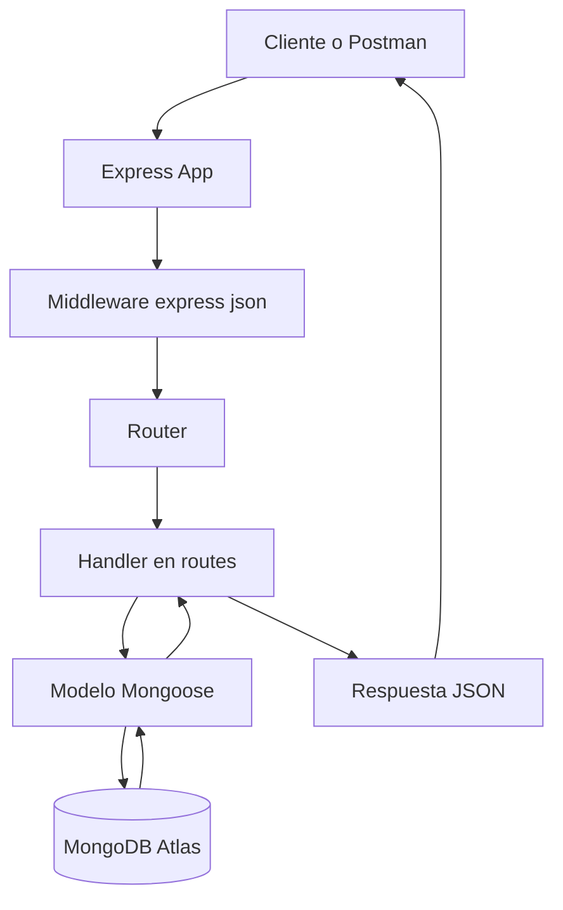
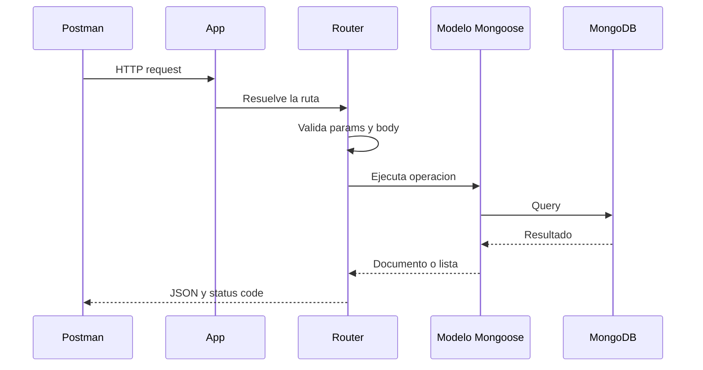
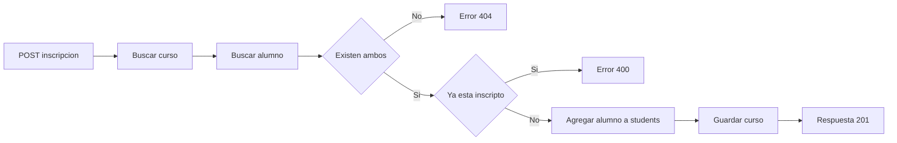
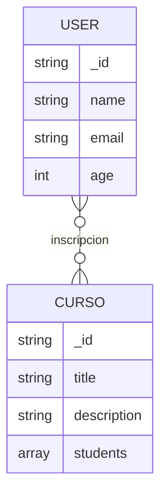

# Proyecto Backend

API REST desarrollada con Node.js, Express y MongoDB Atlas para la gestion de usuarios y cursos.

El proyecto expone endpoints para:

- consultar, crear, actualizar y eliminar usuarios
- crear y listar cursos
- inscribir y desinscribir alumnos en cursos

## Descripcion General

La aplicacion sigue una arquitectura sencilla por capas:

- `app.js` inicializa Express, registra middlewares, monta routers y levanta el servidor
- `routes/` concentra la logica HTTP de cada recurso
- `config/models/` define los esquemas y modelos de MongoDB con Mongoose
- `config/db/` gestiona la conexion a MongoDB
- `postman/` incluye colecciones para probar la API

La persistencia se realiza en MongoDB Atlas mediante Mongoose.

## Tecnologias

- Node.js
- Express
- Mongoose
- MongoDB Atlas
- ES Modules
- Postman
- Nodemon

## Arquitectura



## Flujo Completo de una Request



## Estructura Actual del Proyecto

```text
proyectoBackend/
|-- app.js
|-- package.json
|-- package-lock.json
|-- README.md
|-- atlas.txt
|-- productos.json
|-- config/
|   |-- db/
|   |   `-- connect.config.js
|   `-- models/
|       |-- curso.model.js
|       `-- user.model.js
|-- routes/
|   |-- courses.router.js
|   |-- home.router.js
|   `-- user.router.js
`-- postman/
    |-- Curso.postman_collection.json
    |-- Productos.postman_collection.json
    `-- Users.postman_collection.json
```

## Modulos Principales

### `app.js`

Responsabilidades:

- crear la aplicacion Express
- habilitar `express.json()`
- montar las rutas
- registrar el middleware global de `404`
- conectar la aplicacion a MongoDB Atlas
- iniciar el servidor en `http://localhost:3000`

Rutas montadas:

- `/`
- `/users`
- `/curso`

### `config/db/connect.config.js`

Se encarga de abrir la conexion a MongoDB usando Mongoose.

Modos soportados:

- `local`
- `atlas`

Actualmente la aplicacion se inicia con:

```js
await connectMongoDB("atlas");
```

### `config/models/user.model.js`

Define el modelo `User`.

Campos:

- `name`: `String`, obligatorio
- `email`: `String`, obligatorio, unico
- `age`: `Number`, obligatorio

### `config/models/curso.model.js`

Define el modelo `Curso`.

Campos:

- `title`: `String`, obligatorio, indexado
- `description`: `String`, opcional
- `students`: arreglo de `ObjectId` referenciando a `User`

Relacion:

- un curso puede tener muchos alumnos
- cada alumno inscripto se guarda como referencia dentro de `students`

## Rutas y Metodos

### Home

#### `GET /`

Devuelve una respuesta simple de bienvenida.

Respuesta esperada:

```json
{
  "title": "Bienvenidos"
}
```

### Usuarios

Base path: `/users`

#### `GET /users`

Obtiene todos los usuarios.

#### `POST /users`

Crea un nuevo usuario.

Body esperado:

```json
{
  "name": "Sofia Arano",
  "email": "sofia.arano@example.com",
  "age": 32
}
```

Validaciones actuales:

- `name` obligatorio
- `email` obligatorio
- `age` obligatorio

#### `GET /users/:id`

Obtiene un usuario por su `ObjectId`.

Comportamiento:

- responde `400` si el id no tiene formato valido
- responde `404` si el usuario no existe

#### `PUT /users/:id`

Actualiza un usuario existente.

Ejemplo de body:

```json
{
  "name": "John Perez",
  "age": 80
}
```

#### `DELETE /users/:id`

Elimina un usuario por id.

### Cursos

Base path: `/curso`

#### `GET /curso`

Obtiene todos los cursos.

#### `POST /curso`

Crea un nuevo curso.

Body esperado:

```json
{
  "title": "Backend Avanzado",
  "description": "Curso de Node.js con MongoDB",
  "students": []
}
```

#### `POST /curso/:courseId/inscription/:studentId`

Inscribe un alumno existente en un curso existente.

Comportamiento:

- busca el curso por `courseId`
- busca el usuario por `studentId`
- evita inscripciones duplicadas
- guarda el `ObjectId` del alumno dentro de `students`

#### `DELETE /curso/:courseId/desinscription/:studentId`

Desinscribe un alumno de un curso.

#### `DELETE /curso/:courseId`

Elimina un curso por id.

## Flujo de Inscripcion a un Curso



## Estados HTTP Utilizados

- `200 OK`: consulta o actualizacion correcta
- `201 Created`: recurso creado o inscripcion realizada
- `204 No Content`: eliminacion correcta sin contenido
- `400 Bad Request`: datos invalidos o id con formato incorrecto
- `404 Not Found`: recurso no encontrado o ruta inexistente
- `500 Internal Server Error`: error interno del servidor

## Manejo de Errores

Actualmente el proyecto maneja:

- errores internos con bloques `try/catch` en varias rutas
- validacion de `ObjectId` en rutas de usuario
- middleware global de `404` para rutas no definidas

Respuesta global de ruta inexistente:

```json
{
  "title": "404 - Pagina no encontrada"
}
```

## Ejemplos de Uso en Postman

### Crear usuario

```http
POST http://localhost:3000/users
Content-Type: application/json
```

```json
{
  "name": "Natalia Perez",
  "email": "natalia.perez@example.com",
  "age": 24
}
```

### Buscar usuario por ID

```http
GET http://localhost:3000/users/69bf8c134bd56c8093bb724e
```

### Crear curso

```http
POST http://localhost:3000/curso
Content-Type: application/json
```

```json
{
  "title": "Backend Avanzado",
  "description": "Curso de Node.js con MongoDB",
  "students": []
}
```

### Inscribir alumno

```http
POST http://localhost:3000/curso/ID_CURSO/inscription/ID_USUARIO
```

## Como Ejecutar el Proyecto

### 1. Instalar dependencias

```bash
npm install
```

### 2. Iniciar el servidor

Modo desarrollo:

```bash
npm run dev
```

Modo normal:

```bash
npm start
```

### 3. Probar la API

Servidor local:

```text
http://localhost:3000
```

Endpoints principales:

- `GET /`
- `GET /users`
- `POST /users`
- `GET /users/:id`
- `PUT /users/:id`
- `DELETE /users/:id`
- `GET /curso`
- `POST /curso`
- `POST /curso/:courseId/inscription/:studentId`
- `DELETE /curso/:courseId/desinscription/:studentId`
- `DELETE /curso/:courseId`

## Colecciones Incluidas

Dentro de `postman/` hay colecciones para facilitar pruebas manuales:

- `Users.postman_collection.json`
- `Curso.postman_collection.json`
- `Productos.postman_collection.json`

## Arquitectura de Datos



## Observaciones Tecnicas

- El path de cursos esta definido como `/curso` en singular
- El modelo de cursos referencia usuarios mediante `ObjectId`
- La coleccion real en MongoDB puede verse pluralizada automaticamente por Mongoose
- El proyecto utiliza ES Modules, por eso se usa `import/export`

## Mejoras Sugeridas

- agregar validaciones mas estrictas en cursos
- validar `ObjectId` tambien en rutas de cursos
- usar variables de entorno para credenciales de MongoDB
- agregar capa de controladores y servicios para separar responsabilidades
- incorporar `populate()` para devolver alumnos completos dentro de un curso
- sumar tests automatizados
- documentar la API con Swagger

## Autor

Proyecto desarrollado por Sofia Arano Ibarra.
